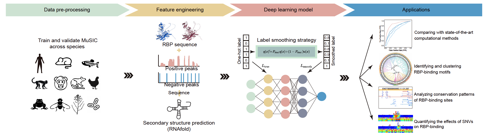

# 🧬 MuSIC

MuSIC is a deep learning toolkit for predicting RNA-binding protein (RBP) interactions with RNA across multiple species, leveraging both sequence and secondary structure information, and evolutionary conservation. It supports within-species and cross-species prediction and high-attention region analysis.

**Authors:**  
Jiale He*, Tong Zhou*, Lufeng Hu*, Yuhua Jiao, Junhao Wang, Shengwen Yan, Siyao Jia, Qiuzhen Chen, Yangming Wang, Yucheng T. Yang#, Lei Sun#  

*Equal contribution, #Corresponding authors

---

### 🧩 MuSIC Framework


- [Getting Started](#getting-started)
- [Datasets](#datasets)
- [Usage](#usage)
- [Output Directory Structure](#output-directory-structure)
- [Citation](#citation)
- [License](#license)
- [Contact](#contact)
---

## Getting Started

### 1. Environment Setup

Set up the Conda environment and install dependencies required for MuSIC.

```bash

conda create -n MuSIC_pretrain python=3.11
conda activate MuSIC_pretrain
```

- **CUDA:**  
  GPU acceleration is recommended. Ensure CUDA 11.8 and compatible PyTorch are installed.

### 2. Requirements

Ensure that you have the required Python version and dependencies to run the MuSIC toolkit.

```bash
pip install pandas==3.0.0
pip install scikit-learn
pip install scipy==1.17.0
pip install torch==2.1.0
pip install h5py
pip install ml-collections==1.1.0
pip install numpy==1.26.4
```

### 3. Pretrained Model Installation and Environment Setup

Install the necessary pretrained models for RNA and RBP sequence embeddings.

See the [./pretrained_model/README.md](./pretrained_model/README.md).

### 4. RNAfold Installation

Install the necessary pretrained models for RNA folding and RBP sequence embeddings.

See the [./RNAtools/README.md](./RNAtools/README.md).

---

## Datasets 

### Directory Structure

Understand the organization of the datasets used for training, validation, and prediction.

```text
data/
├── within_species/      # Within-species test datasets
├── cross_species/       # Cross-species test datasets
├── predict_data/             # Example FASTA files for prediction
├── protein_fasta_embedding/           # RBP sequence and embedding from ProT5
```
### Data Preprocessing

Convert raw FASTA files into structured H5 files with sequence embeddings and structural predictions to prepare the data for model training, validation, or prediction.

```bash
taskset -c 1 python main.py \
    --gerenate_embeddingh5 --infer_embedding_data_process \
    --infer_fasta_path data/predict_data/mouse_test.fa \
    --gpuid 0 \
    --batch_size 64 \
    --pretrain_RNA_model RiNALMo
```
**Options:**
- `--train_embedding_data_process`: Use this option for training datasets.
- `--validate_embedding_data_process`: Use this option for validation datasets.
- `--infer_embedding_data_process`: Use this option for inference datasets.

**Output:**  
The resulting file, `mouse_test_RiNALMo_rnaembedding.h5`, will be saved in the same directory as the input FASTA file.

### Data Format

- ***.fa**: Input RNA sequences
- ***_annotation.tsv**: Structural annotation files for datasets
- ***_RiNALMo_rnaembedding.h5**: Combined sequence embeddings and structure features for model input

---

## Usage

### Cross-Species Training & Validation

Train and validate the model on cross-species datasets, enabling the model to learn and predict RBP–RNA interactions across species.

```bash
# Cross-Species Training
taskset -c 0 python main.py \
    --train \
    --rbp_name FUS_HITS-CLIP_Human \
    --smooth_rate 0.8725 \
    --file_path ./data/cross_species \
    --source_species HUMAN \
    --target_species MOUSE \
    --gpuid 0 \
    --batch_size 64 \
    --pretrain_RNA_model RiNALMo
```

```bash
# Cross-Species Validation
taskset -c 0 python main.py \
    --validate \
    --rbp_name FUS_HITS-CLIP_Human \
    --smooth_rate 0.8725 \
    --file_path ./data/cross_species \
    --source_species HUMAN \
    --target_species MOUSE \
    --gpuid 0 \
    --batch_size 64 \
    --pretrain_RNA_model RiNALMo
```

**Additional Arguments:**
- `--train`: Initiates the model training process.
- `--validate`: Initiates the model validation process.
- `--rbp_name`: Specifies the name of the RBP.
- `--smooth_rate`: Defines the label smoothing rate, which reflects the conservation between the target RBP and the source RBP.
- `--file_path`: Specifies the path to the dataset directory, which contains two subdirectories: negative data and positive data. Each subdirectory includes .fa files. During the process, [RNAfold](./RNAtools/) will be used to first generate ***_annotation.tsv** files，followed by the deployment of the pre-trained [RiNALMo](./pretrained_model/) to generate ***_RiNALMo_rnaembedding.h5** files.
- `--source_species`: Indicates the source species for the dataset, used to retrieve the RBP sequence embeddings for the source species.
- `--target_species`: Indicates the target species for the dataset, used to retrieve the RBP sequence embeddings for the target species.
- `--gpuid`: Specifies the GPU device ID to be used for training or validation.
- `--batch_size`: Defines the batch size for training or validation.
- `--pretrain_RNA_model`: Specifies the name of the pretrained RNA model to be used.

---

### Within-Species Training & Validation

Train and validate the model using within-species datasets for more specific RBP–RNA interaction predictions.

```bash
# Within-Species Training
taskset -c 0 python main.py \
    --train \
    --rbp_name PUM2 \
    --smooth_rate 1 \
    --file_path ./data/within_species \
    --source_species HUMAN \
    --target_species HUMAN \
    --gpuid 0 \
    --batch_size 64 \
    --pretrain_RNA_model RiNALMo
```

```bash
# Within-Species Validation
taskset -c 0 python main.py \
    --validate \
    --rbp_name PUM2 \
    --smooth_rate 1 \
    --file_path ./data/within_species \
    --source_species HUMAN \
    --target_species HUMAN \
    --gpuid 0 \
    --batch_size 64 \
    --pretrain_RNA_model RiNALMo
```

**Arguments:**
- `--train`: Start the model training process.
- `--validate`: Start the model validation process.
- `--rbp_name`: Name of the RBP.
- `--smooth_rate`: Label smoothing rate. For within-species training, this value is set to 1.
- `--file_path`: Path to the dataset directory.
- `--source_species`: The source species for the dataset.
- `--target_species`: The target species for the dataset. For within-species tasks, this should be the same as the source species.
- `--gpuid`: GPU device ID to use for training or validation.
- `--batch_size`: Batch size for training or validation.
- `--pretrain_RNA_model`: Name of the pretrained RNA model to use.

---

### Inference (Prediction)

Make predictions on new RNA sequences, generating scores indicating the likelihood of interaction with the RBP.

```bash
taskset -c 1 python main.py \
    --infer \
    --infer_fasta_path data/predict_data/mouse_test.fa \
    --rbp_name FUS_HITS-CLIP_Human \
    --smooth_rate 0.8725 \
    --source_species HUMAN \
    --target_species MOUSE \
    --gpuid 0 \
    --batch_size 64 \
    --pretrain_RNA_model RiNALMo
```
**Output:**  
Inference results are saved as `.inference` files in `music/out/infer/`.
This `.inference` file contains three columns: the first column lists the RNA names, the second is a padding column with all values set to 1, and the third contains the predicted scores.
| RNA_name | Padding | Predicted_Score |
|----------|---------|-----------------|
| RNA1     | 1       | 0.85            |
| RNA2     | 1       | 0.92            |
| RNA3     | 1       | 0.78            |
| ...      | 1       | ...             |
---

### Motif Resource

Predicted RNA binding motifs for 184 RBPs across 11 species are available for download:

- **PNG:** [MuSIC 11 Species Motif Collection (PNG)](https://github.com/GALE1228/music_11species_motif_png2026)

---

## Output Directory Structure

Understand where each type of output will be saved during the training, validation, and inference processes.

- `music/out/model/`: Trained model weights (`.pth`)
- `music/out/logs/`: Training and validation logs (`.txt`)
- `music/out/evals/`: Evaluation metrics (`.metrics`, `.probs`)
- `music/out/infer/`: Inference results (`.inference`)

## Citation

If you use MuSIC in your research, please cite:

```bibtex
@article{xxx,
  title={xxx},
  author={xxx},
  year={xxx},
  doi={xxx},
  journal={xxx}
}
```

---

## License

This project is covered under the MIT License.

---

## Contact

Thank you for using MuSIC! For questions, bug reports, or contributions, please contact the authors or open an issue on GitHub.

---
